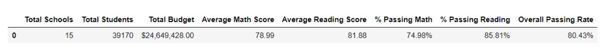
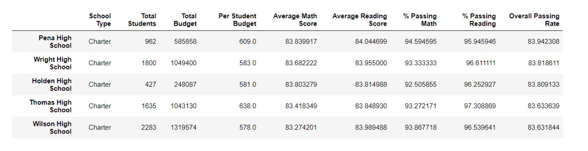
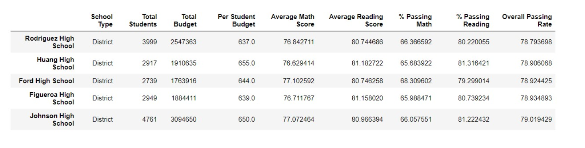
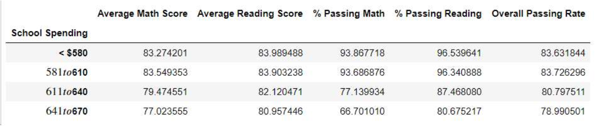
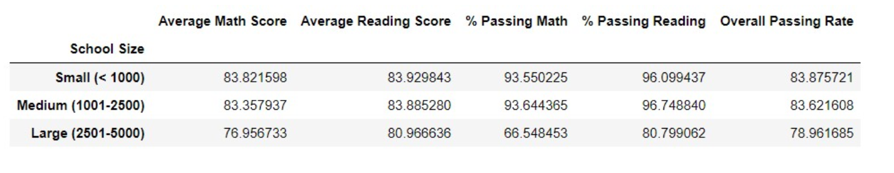

# Pandas Challenge - Academy of Py

## Background
Aggregate the data to and showcase obvious trends in school performance.

## Findings

Overall data across all districts show that average reading score is higher and as a result the percentage of students pass is higher.
 

When you group by schools and sort by Overall passing rate, the top 5 performers are charter schools while the bottom 5 performers are District schools
 

 
This was apparent when you look at the data by school type.  Charter Schools had higher average math and reading scores, percentage of students passing both Math and Reading.
 

Interestingly, when you slice the data by school spending per student, those schools that spend less than $580 per student have higher passing rates in both Math and Reading.
 

When you look at the data based on the size of the school, smaller schools (school size less than 1000) had highest Math and Reading scores and Overall Passing Rate but mediums size schools had the highest percent of students that had passing Math and Reading scores.
 

